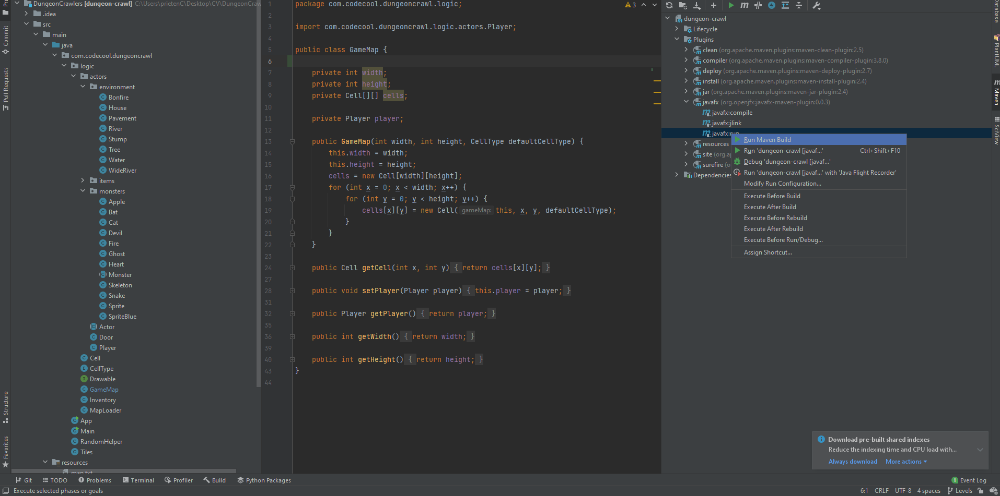
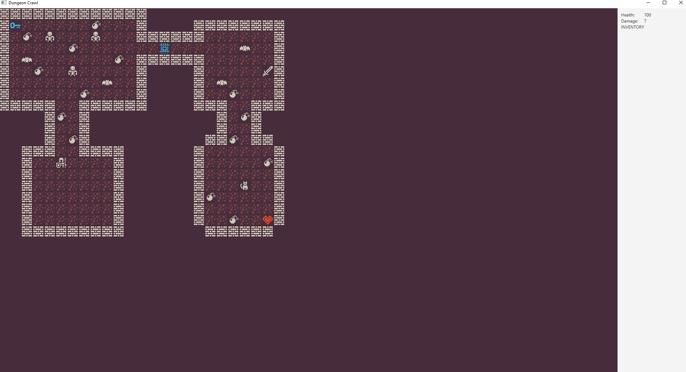
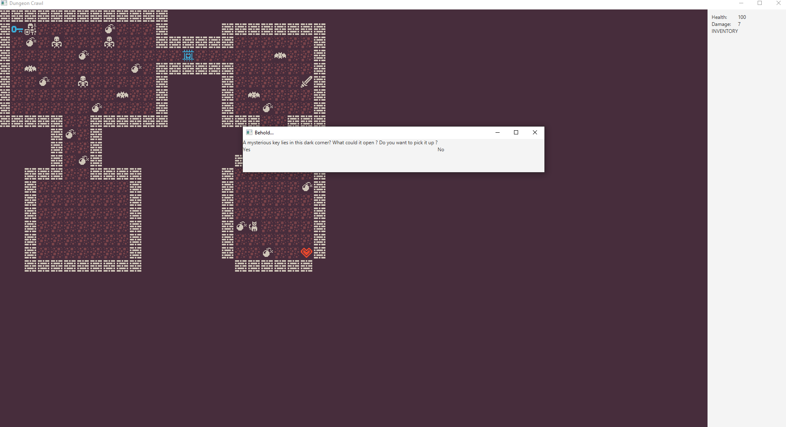
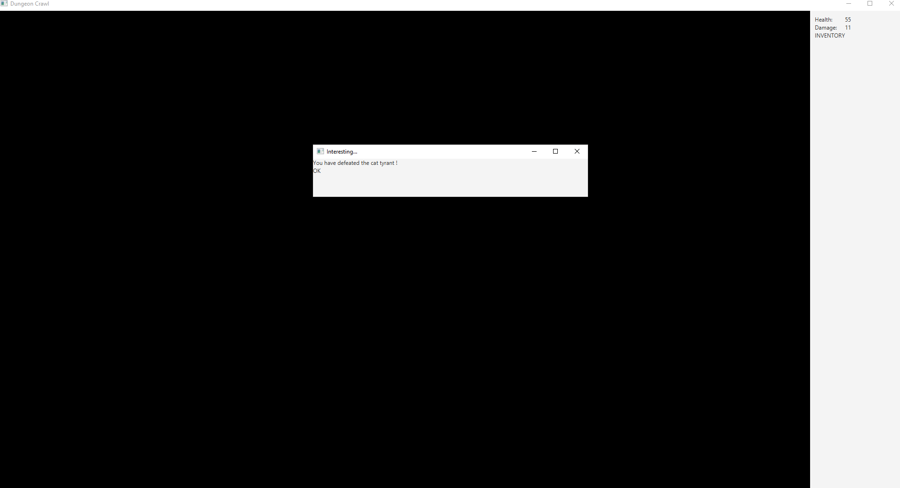
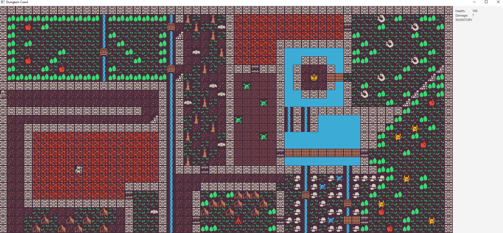
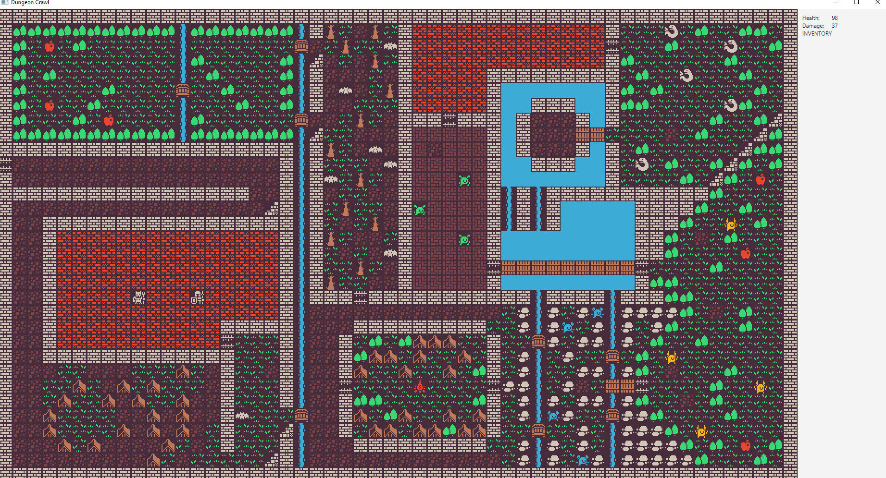

<!--
*** To avoid retyping too much info. Do a search and replace for the following:
*** github_username, repo_name, twitter_handle, email, project_title, project_description
-->


<!-- PROJECT SHIELDS -->
<!--
*** I'm using markdown "reference style" links for readability.
*** Reference links are enclosed in brackets [ ] instead of parentheses ( ).
*** See the bottom of this document for the declaration of the reference variables
*** for contributors-url, forks-url, etc. This is an optional, concise syntax you may use.
*** https://www.markdownguide.org/basic-syntax/#reference-style-links
-->
[![LinkedIn][linkedin-shield]](https://www.linkedin.com/in/stefan-sorea-979a1b182/)


<!-- PROJECT LOGO -->
<br />
<p align="center">

[comment]: <> (  <a href="https://github.com/sunStephan/DungeonCrawler">)

[comment]: <> (    )

[comment]: <> (  </a>)

  <h3 align="center">DungeonCrawler</h3>


<!-- TABLE OF CONTENTS -->
<details open="open">
  <summary><h2 style="display: inline-block">Table of Contents</h2></summary>
  <ol>
    <li>
      <a href="#about-the-project">About The Project</a>
      <ul>
        <li><a href="#built-with">Built With</a></li>
      </ul>
    </li>
    <li>
      <a href="#getting-started">Getting Started</a>
      <ul>
        <li><a href="#prerequisites">Prerequisites</a></li>
        <li><a href="#installation">Installation</a></li>
      </ul>
    </li>
    <li><a href="#usage">Usage</a></li>
    <li><a href="#contact">Contact</a></li>
    <li><a href="#acknowledgements">Acknowledgements</a></li>
  </ol>
</details>


<!-- ABOUT THE PROJECT -->
## About The Project

<p align="left">
    <br />
    DungeonCrawler is a RogueLike game.<br /><br />
    Roguelike (or rogue-like) is a subgenre of role-playing video games characterized by a dungeon crawl through procedurally generated levels, usually turn-based gameplay, grid-based movement, and permanent death of the player character. Most roguelikes are based on a high fantasy narrative, reflecting their influence from tabletop role playing games such as Dungeons & Dragons.
    <br /><br />
    This project has been built using Java and JavaFX.
    Java has been used to build the backend of the game, while JavaFX offers us the GUI.
    <br />
    <br />
    <a href="https://github.com/sunStephan/DungeonCrawler"><strong>Explore the docs »</strong></a>
    <br />

  </p>


### Built With

* [Java](https://en.wikipedia.org/wiki/Java_(software_platform))
* [JavaFx](https://en.wikipedia.org/wiki/JavaFX)


<!-- GETTING STARTED -->
## Getting Started

To get a local copy up and running follow these simple steps.


### Prerequisites

Any computer belonging to millennia III will work.

### Installation

1. Clone the repo.
   ```sh
   git clone https://github.com/sunStephan/DungeonCrawler.git
   ```
    For a guide how to clone a Git Repo press [here](https://docs.github.com/en/github/creating-cloning-and-archiving-repositories/cloning-a-repository-from-github/cloning-a-repository).


2. [Install Java Standard Edition Development Kit](https://www.oracle.com/java/technologies/javase-downloads.html).
<br/>
   

3. [Install Java Fx](https://openjfx.io/).


4. Install an IDE to be able to run the game. As a suggestion, check out IntelliJ or Visual Studio Code.


<!-- USAGE EXAMPLES -->
## Usage

First, start the program by running the JavaFX plugin.



This is your starting point


You can fight monsters, find and use artefacts of power and interact with buildings.



You win by defeating the bosses of each level.




<!-- LICENSE -->
## License

See `LICENSE` for more information.

<!-- CONTACT -->
## Contact

Șorea Ștefan - [@sorea.stefan@gmail.com](sorea.stefan@gmail.com)

Project Link: [https://github.com/sunStephan/DungeonCrawler](https://github.com/sunStephan/DungeonCrawl)


<!-- ACKNOWLEDGEMENTS -->
## Acknowledgements

Special thanks to Ștefania Rotaru for contributing to the development of this project.


<!-- MARKDOWN LINKS & IMAGES -->
<!-- https://www.markdownguide.org/basic-syntax/#reference-style-links -->
[contributors-shield]: https://img.shields.io/github/contributors/github_username/repo.svg?style=for-the-badge
[contributors-url]: https://github.com/github_username/repo_name/graphs/contributors
[forks-shield]: https://img.shields.io/github/forks/github_username/repo.svg?style=for-the-badge
[forks-url]: https://github.com/github_username/repo_name/network/members
[stars-shield]: https://img.shields.io/github/stars/github_username/repo.svg?style=for-the-badge
[stars-url]: https://github.com/github_username/repo_name/stargazers
[issues-shield]: https://img.shields.io/github/issues/github_username/repo.svg?style=for-the-badge
[issues-url]: https://github.com/github_username/repo_name/issues
[license-shield]: https://img.shields.io/github/license/github_username/repo.svg?style=for-the-badge
[license-url]: https://github.com/github_username/repo_name/blob/master/LICENSE.txt
[linkedin-shield]: https://img.shields.io/badge/-LinkedIn-black.svg?style=for-the-badge&logo=linkedin&colorB=555
[linkedin-url]: https://linkedin.com/in/github_username
